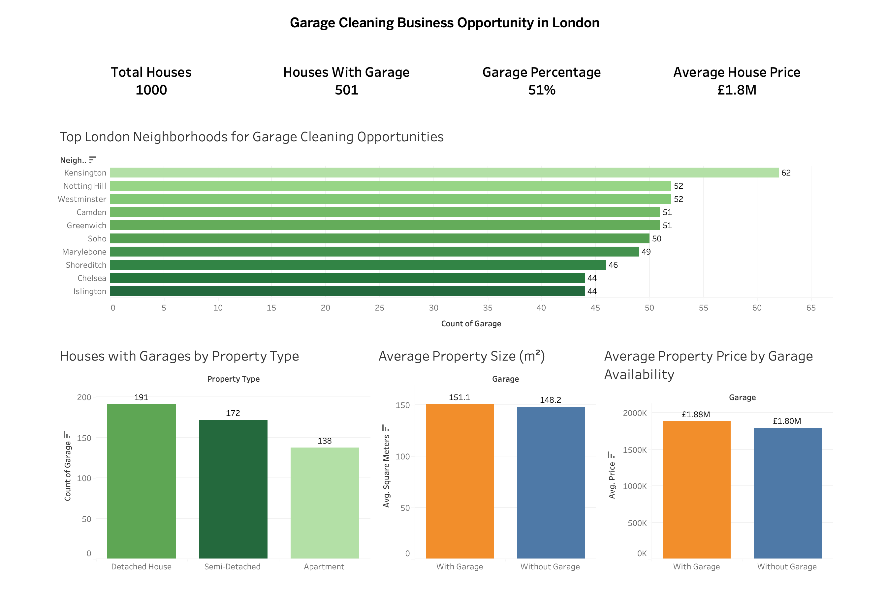

# 🏠 London Garage Cleaning Business Opportunity Analysis

## 📌 Project Overview

This project analyzes the London housing market to evaluate the feasibility of launching a **garage cleaning and organization business**. Using SQL and Tableau, the analysis identifies neighborhoods with the highest concentration of garages, ideal customer segments, and key market characteristics to support data-driven business decisions.

---

## 🎯 Business Problem

Before launching a garage cleaning business, I wanted to answer the following questions:

- How many houses have garages?
- Which London neighborhoods have the highest concentration of garages?
- Which property types are most likely to have garages?
- Do garage owners tend to own higher-value properties?
- Do garage-equipped houses tend to be larger?

The goal was to use data analytics to identify the most promising market and customer segment.

---

## 🛠 Tools Used

- **Google BigQuery** – SQL Analysis
- **Tableau Public** – Data Visualization
- **Google Sheets** – Data Cleaning & Validation
- **GitHub** – Project Documentation

---

## 📂 Project Structure

```
London-Garage-Cleaning-Business-Analysis
│
├── data/
├── sql/
├── dashboard/
├── reports/
├── images/
└── README.md
```

---

## 📊 Dashboard Preview

> Replace the image below with your dashboard screenshot after uploading it to the `images` folder.



---

## 🔍 Key Findings

- ✅ 50.1% of properties have garages.
- ✅ Kensington has the highest concentration of garage-equipped houses.
- ✅ Detached houses are the strongest target customer segment.
- ✅ Houses with garages have a higher average property value.
- ✅ Houses with garages are slightly larger on average.

---

## 💼 Business Recommendations

- Launch the business in **Kensington**, **Notting Hill**, and **Westminster**.
- Focus marketing on **detached house owners**.
- Promote sustainability by helping homeowners organize, reuse, and resell unwanted garage items.
- Expand to additional neighborhoods after building a customer base.

---

## 📈 Skills Demonstrated

### SQL

- Data aggregation
- Filtering
- GROUP BY
- ORDER BY
- CAST
- Aggregate functions
- Business analysis

### Data Visualization

- Dashboard design
- KPI creation
- Business storytelling
- Executive reporting

### Data Analytics

- Ask
- Prepare
- Process
- Analyze
- Share
- Act

---

## 📄 Project Report

The complete step-by-step report is available in the **reports** folder.

---

## 👨‍💻 Author

**Afridi Islam**

Aspiring Data Analyst passionate about using SQL, spreadsheets, and Tableau to solve real-world business problems.

---

## ⭐ If you found this project interesting, feel free to star the repository!
